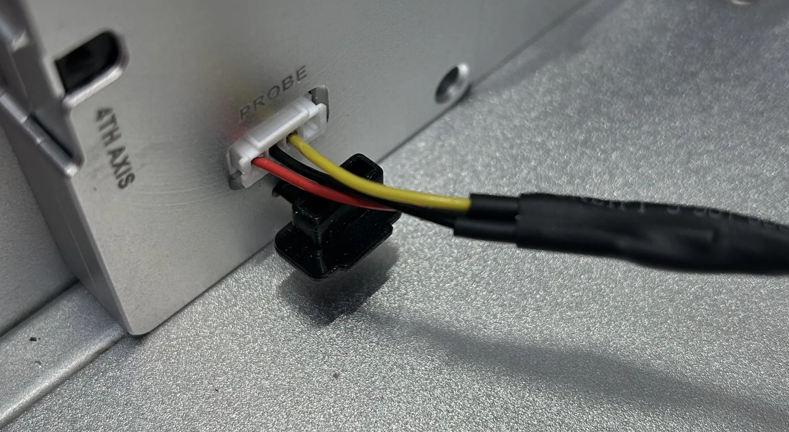

# WCS Probing in Fusion with the Carvera

The Carvera Community post-processor has introduced support for WCS Probe
operations! Use a touch probe in the spindle to unlock a world of fancy pants
probing operations you never knew existed!

## Features

| Feature | Status |
|---------|--------|
| Basic probes with stock firmware | ✅ |
| Probe away from WCS origin | ✅ |
| Override driving WCS | ✅ |
| Integration with manual tool changes | ✅ |
| NC and NO probes | ✅ |
| Power on for Carvera Air probe | ✅ |
| Protected probe moves | ✅ |
| Advanced probing with community firmware | ⏳ |
| Geometry probes | 🔄 |
| Inspection probes | 🔄 |

## Equipment needed

[Fae's Instructables](http://instructables.com/Carvera-Touch-Probe-Modifications/) on probe modifications, wiring up power, gcodes, and more.

The main thing you need to make sure of is that the probe fits in your spindle. Most of the Aliexpress / Amazon probes we've found have a 6mm shank, so you'll need the [6mm spindle collet](https://www.makera.com/products/spindle-collet?variant=43448718885089) from Makera to have them fit.

NC or NO variants should both work if you select the correct one in the post-processor. Note: only NC has been tested so far.

The probe will come with a USB-C pigtail cable. One end will have USB-C for the probe, the other will be three wires. You'll need to crimp on a JST XH-4Y connector as shown below.

* [PGFUN CNC Touch Probe](https://www.amazon.com/dp/B0B3XMFDX5) (Amazon)
* [V5 Touch Probe compatible with mach3 and grbl](https://www.aliexpress.us/item/3256803607054329.html) (Aliexpress, note the page defaults to the stylus not the probe)

## Fusion setup

Import the [probe tool](<probe tool.json>) into your tool library, or set one up yourself. Especially check the measurements to make sure yours matches.

Note that *manual tool change* has been selected! Also the tool should not be numbered 1-6 to prevent confusion with the ATC on the Carvera.

In your post-processor setup, there are three options you need to care about.

This shows settings for the Carvera, but there are settings for the Carvera Air in there too. Since the Air does manual tool changes you should be able to keep that setting as is.

> [!WARNING]
> Failing to set Probe Sensor Type correctly is guaranteed to lead to a crash!

1. For the origin Carvera, use Fusion Manual Tool changes. The post-processor will detect you're using a tool numbered outside 1-6 and the controller will pause the program to prompt you to change tools.
2. Probe Sensor Type *must be set correctly* because it governs whether the probe will stop moving when it touches a surface, or keep going and potentially destroy itself.
3. Probe Tool Behavior - this allows you to select the community firmware gcodes for probing (still a work in progress) or gcodes for stock firmware. Selecting the Air will make sure the probe laser is turned on to power the probe throughout.

## Probing 101

> [!IMPORTANT] 
> Probing WCS in Fusion is a lot more flexible and likely does not work the way
> you think it works. Please at least skim these sections to avoid confusion!
> TL;DR you should be able to explain how "override driving WCS" works in Fusion
> before attempting to probe in Fusion.

### The basics

To run a job successfully on our Carvera CNC machines, we must ensure that the
work coordinate system (WCS) origin used in our CAM program is precisely located
at our chosen work origin in the Carvera Controller. If there is misalignment
between these two coordinate systems, our tool paths will be offset in one or
more axis; at best leading to suboptimal results, and at worst leading to a
crash which could damage our machine.

The WCS origin can be thought of as a property of the CNC program. It's deliberately intended to decouple the CNC program from having to know or care 
about the machine coordinate system (MCS). The place where these two coordinate
systems meet is in a table of offsets, stored on the machine, usually numbered
from G54 through to G59. Each entry in this table represents the set of MCS 
coordinates. These map the origin point (0,0,0) of our CNC program to a physical point in space somewhere in the machine.

On the Carvera, a lot of this complexity is abstracted away from us. Rather
than having to carefully manage a table of offsets by punching keys on a terminal
attached to the machine, the Carvera sets the default offset, G54, at a known
point on the machine bed at the factory. This is the anchor 1 point we use in the
bottom left of the bed. In the controller all we can do is shift our work origin
around this one sacred point. 

_Anchor point 1 has a block of tungsten. Anchor point 2 has the probing playground model._

Selecting anchor 2, manually inputting an offset, or using the manual xyz probe,
simply move this offset around temporarily. Its MCS coordinates are saved in in
the machine config and restored when we set our offset in the controller back to
0,0.

0,0 ? What about 0,0,0? The Carvera does not have a calibrated point for the Z
axis from the factory. That's why we pretty much always use the wireless probe
to pick a Z coordiate when we start a job.

### Probing the WCS origin directly

This is how the Carvera encourages us to think about probing, and it works
the majority of the time because it's easy. But it can cause some confusion 
when you start probing with Fusion. And when you start working with fixtures,
vises, and two sided machining, it can be limiting and quite frustrating!

> [!NOTE]
> You can probe the WCS origin directly in Fusion just fine too. 

Here is the simplest possible part. Its WCS is set to the front left topmost
point. We have wedged the stock up against anchor 1, so to some approximation
its origin is already aligned with the X and Y coordinates at G54. 

However, the origin of the Z axis is as yet unknown to the Carvera. It likely thinks the Z axis is somewhere on the bed. We solve this problem by performing
a wireless Z probe. This operation bonks the top surface of the part, and records
the MCS Z coordinate it measured in G54. Now the WCS origin of our model 
(always to some approximation) and the origin of G54 occupy the same point in space.

> [!WARNING]
Notice what happened here!

When we use any of the Carvera's techniques for aligning WCS and G54, we
are _changing the origin_ of G54. 

- setting the work origin offset in the controller
- performing a wireless Z probe
- using the manual XYZ probe

All of these operations move G54 somewhere else in space. If they move G54
and your WCS origin such that they're lined up with the right physical point
on your stock, everything is rosy. So how can this go wrong?

> [!WARNING]
Keep this in mind! Fusion's toolpaths are positioned relative to your WCS origin

Consider this model. The WCS origin has been moved to the top center of the 
box. What will happen when you run this job?

You will likely realize something is wrong in the controller immediately,
because the tool path bounding box will be offset down and to the left. You
won't be able to tell from the Controller, but it will also be offset into and
through the bed of the Carvera. Fusion's toolpaths are relative to the WCS origin, and you WCS origin maps to G54, and G54 maps to anchor 1, and the top dead center of your stock is for sure nowhere near that point.

There's no way to fix through probing the Carvera way. Our wireless Z probe can
find the top just fine. But the only thing the manual XYZ probe can do is move 
the zero coordinates to one of the corners of the box.

If you threw this question into the Discord, you'd get an answer pretty quickly: move your WCS origin to a corner of the part so that you can probe it, because you need to set the zero points of your G54 offset.

_**OR DO YOU???**_

### Probing the WCS indirectly

> [!NOTE]
> [This Autodesk forum post](https://forums.autodesk.com/t5/fusion-manufacture/probing-routine-not-updating-offset-correctly/m-p/10954277/highlight/true#M117429) explains how this works.
> [This NYC CNC provides a quick explainer](https://www.youtube.com/watch?v=CMK5XAxhSr4)

Because Fusion knows about your model geometry, it can do something fancy. It can allow you to probe a random surface, which will adjust the position of the WCS origin relative to where you probed.

For the cases discussed earlier, everything continues to work as-is. If you're probing a surface that is coincident with one of the WCS origin planes, the expected relative distance will be 0. So, it works like the manual XYZ probe.

Consider a slightly weirder case, the probe playground (available in this repo).

Here, the WCS origin is literally floating in the air, entire detached from the part and from reality. What happens when we probe the surface indicated to set the X value of the WCS origin?

The X coordinate being probed, relative to the WCS origin, in this case is -72.00mm. Once the probe touches off this surface, rather than setting the G54 X offset to 0, it will set it such that _the offset between this surface and the WCS origin is -72.00mm_.

What happens when we probe Z on the top of that same boss? The WCS origin's Z position will be adjusted such that the point we probed is at exactly -15.00mm relative to the origin.

How is any of this useful?

In the case of a part flip, it can be very useful. It might be the case that you don't have any machined surfaces on the outside of the part from which to take a measurement. If you're positioning a vise, you can set your G54 offset such that you know the part is approximately located on the machine where your probe can find it.

You can then take a measurement from a machined surface that is accessible elsewhere on the part, such as a slot or a bore. You don't really have to care about your WCS origin's exact position in space; what you care about is making sure the machine can locate the feature you're interested in. So: probe that feature instead.

### Overriding WCS origins

*TODO*

## Testing probing

TODO: info about probe playground and how to run it

## References

For making modications or learning about how probing works, here are some useful references.

* [Autodesk's post-processor training guide](https://cam.autodesk.com/posts/posts/guides/Post%20Processor%20Training%20Guide.pdf) is the canonical reference
* [API docs](https://cam.autodesk.com/posts/reference/index.html) for the post-processor runtime fills in some blanks not covered in the reference
* [Autodesk Post Library](https://cam.autodesk.com/hsmposts) contains about 200 example post-processors. To understand what was common I downloaded all 200 with a script. The vast majority of post-processors exhibit high degrees of "copypasta" and use JavaScript idioms from the early 2000s. The post binary actually links a relatively recent SpiderMonkey, allowing you to use features up to and including ECMAScript 2023.
* [Haas inspection plus reference](https://www.haascnc.com/content/dam/haascnc/en/service/reference/probe/renishaw-inspection-plus-programming-manual---2008.pdf) - explains how their probing macros work, and is useful for understanding what the different Fusion probe operations are supposed to look like
* [Community Speeds and Feeds doc](https://docs.google.com/spreadsheets/d/1i9jD0Tg6wzTpGYVqhLZMyLFN7pMlSfdfgpQIxDKbojc/edit?gid=700548077#gid=700548077) which contains sheets with gcode and mcode for stock and community firmware.
* [Linux CNC gcode reference](https://linuxcnc.org/docs/2.6/html/gcode/gcode.html)
* [Community firmware M460..M465 docs](https://github.com/Carvera-Community/Carvera_Community_Firmware/tree/Dev/tests/TEST_ProbingM460toM465)
* Autodesk Forum posts [like this one](https://forums.autodesk.com/t5/fusion-manufacture/probing-routine-not-updating-offset-correctly/m-p/10954277/highlight/true#M117429)